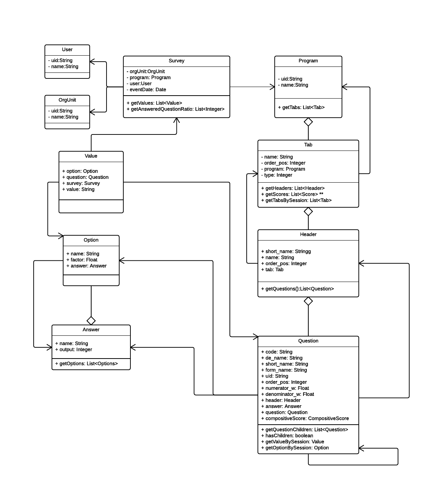

# Classes overview

## Domain model overview

The core of the app depends on the relationships between its domains.

## Basic flows

The two most important flows are:

    - Getting a whole tab drawn.
    - Calculating the score.

`TODO: pending`

