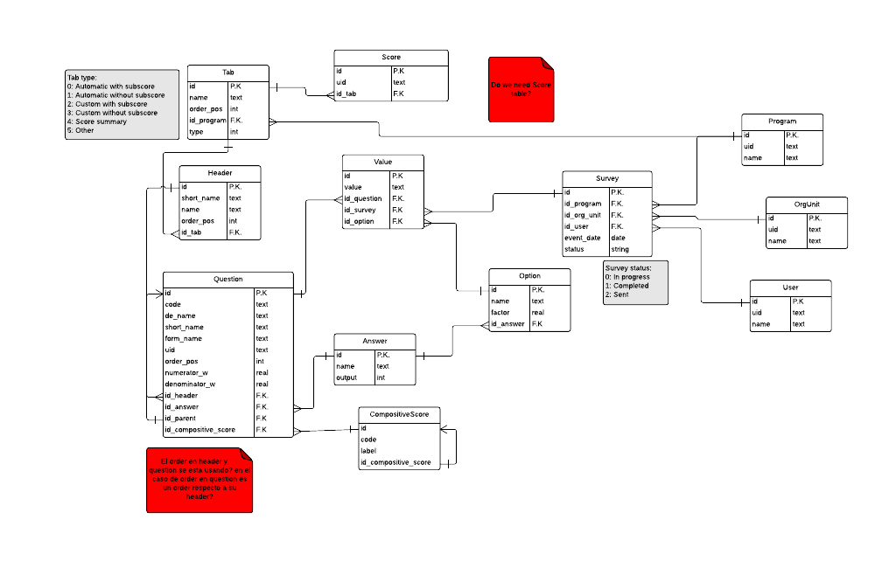
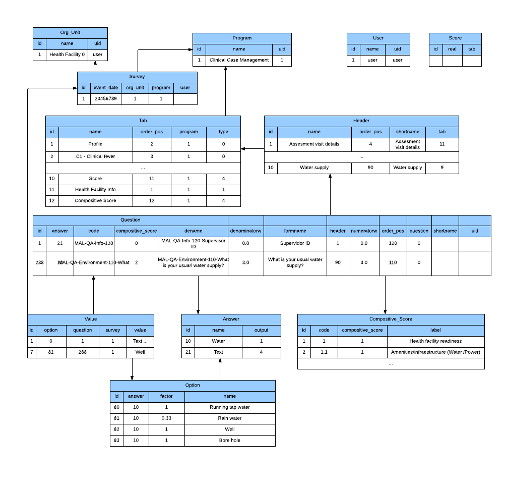

# Database model

## EER model

The whole database model of the app looks like this:

## Sample data

The easiest way to understand what those tables and columns mean is showing some random connected data:

