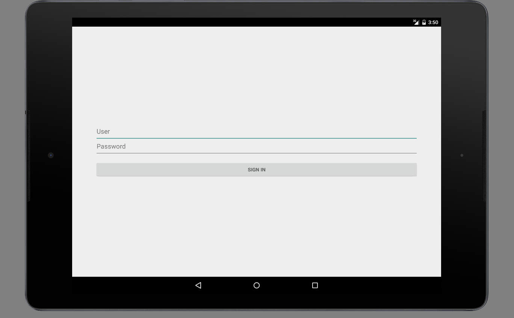
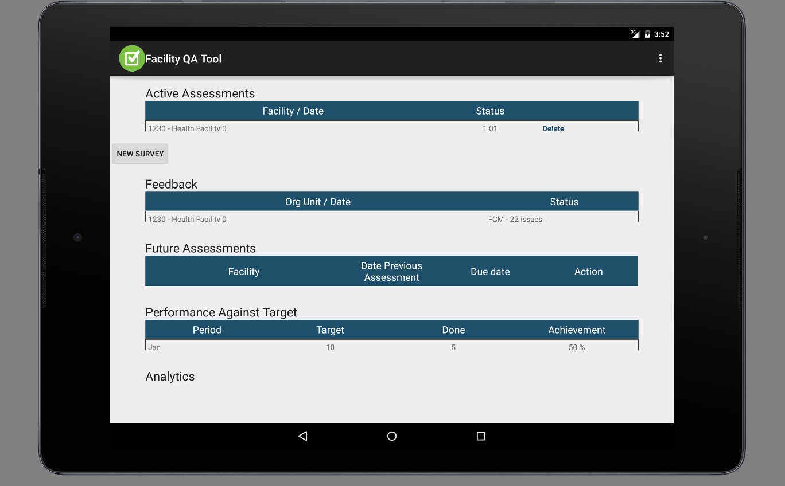
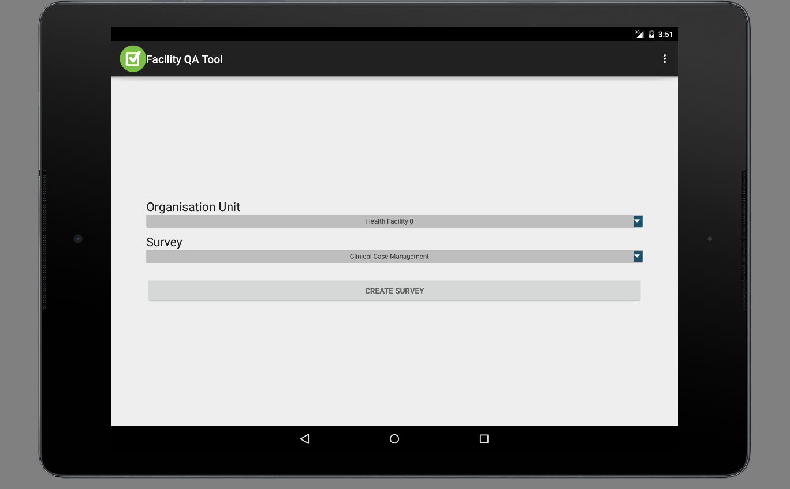
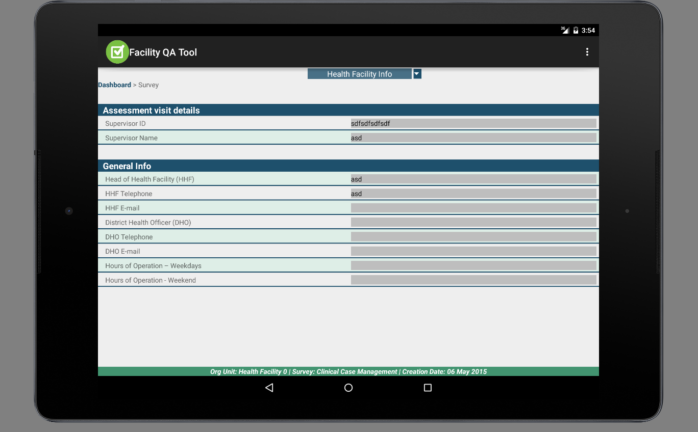
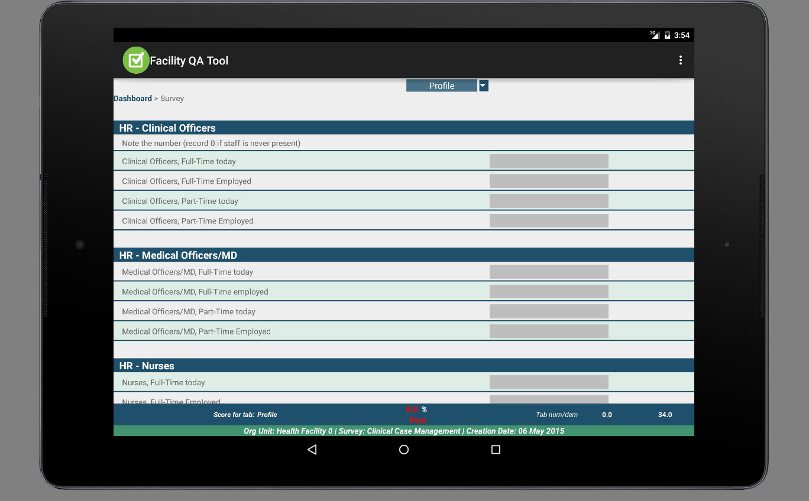
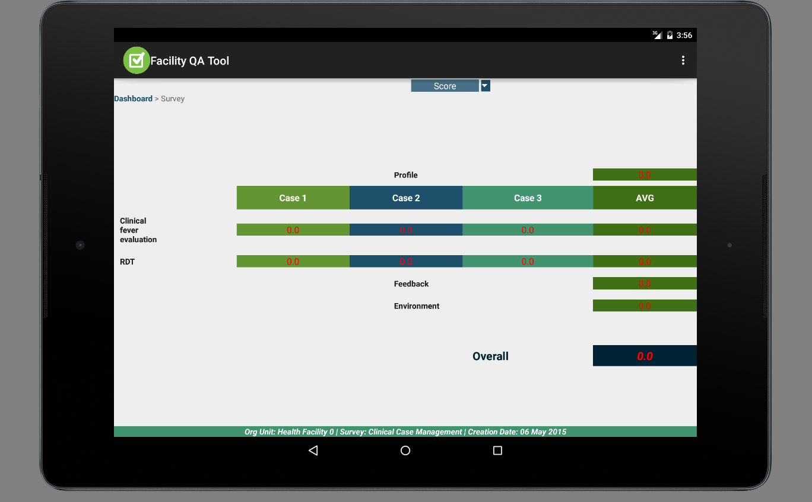
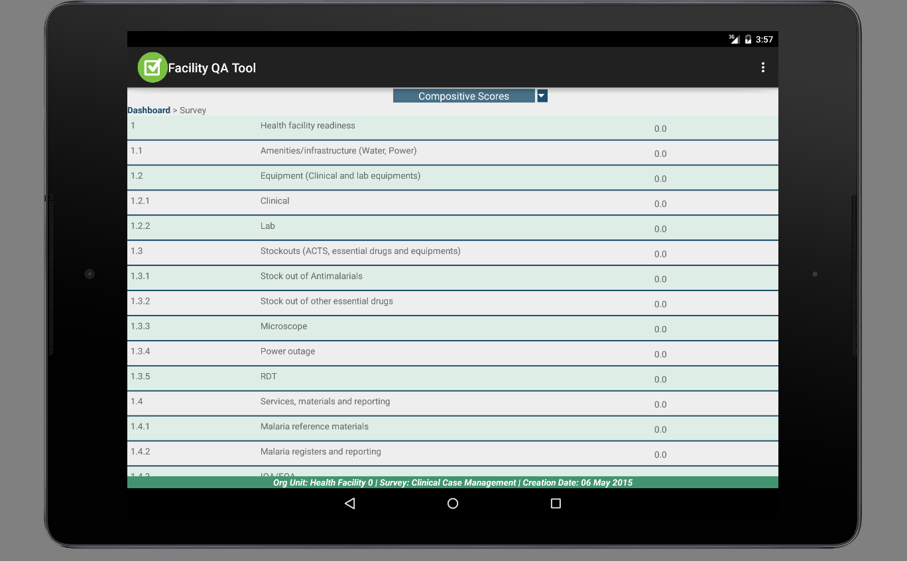

# App overview

A quick overview of the app.

## Navigation 

    Login
        Dashboard
            Create survey
            Survey
                Survey Page   //different tabs
                Survey Profile
                Survey Score

A quick overview of the navigation flow inside the app would be:

## Screenshots

Compilation of screenshots:

### Login

There are a couple of hardcoded default users (*user/user* and *admin/admin*)

### Dashboard

The main view of the app with a summary of different things.

### Create

An initial form to setup the new survey.

### Survey pages

Each survery is made of:

    survey < tab < header < question

### Profile tab

A survey might have some special tabs which include scores.

### Score tab

There is a special tab called **'score'** where the scores from all the survey are added.

### Composite tab

Finally there is another specific tab where the scores are added according to its hierarchy.

